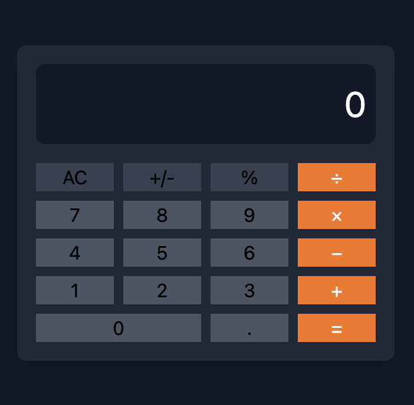

# 📱 Calculatrice Style iPhone | iPhone-Style Calculator

## 📝 Description | Description
**FR :**  
Ce projet est une calculatrice basique, inspirée du design minimaliste de la calculatrice de l'iPhone.  
Elle a été réalisée pour démontrer mes compétences en développement web front-end (HTML, CSS, JavaScript) et en intégration de Tailwind CSS.  

**EN :**  
This project is a basic calculator inspired by the minimalist design of the iPhone's calculator.  
It was created to showcase my front-end web development skills (HTML, CSS, JavaScript) and my ability to use Tailwind CSS for styling.  

---

## 💡 Fonctionnalités | Features
- **FR :**  
  - Calculs de base : addition, soustraction, multiplication, division.  
  - Design moderne avec Tailwind CSS.  
  - Interface responsive adaptée aux différents écrans.  

- **EN :**  
  - Basic calculations: addition, subtraction, multiplication, division.  
  - Modern design with Tailwind CSS.  
  - Responsive interface suitable for various screen sizes.  

---

## 🔧 Compétences utilisées | Skills Used
- **HTML :** Construction de la structure de la page.  
- **CSS (Tailwind CSS) :** Création d'un design propre et épuré.  
- **JavaScript :** Gestion de la logique et des interactions de la calculatrice.  
- **Git & GitHub :** Suivi du projet et collaboration.  

---

## 🚀 Comment exécuter le projet | How to Run the Project
1. **FR :** Clonez le dépôt GitHub :  
   ```bash
   git clone https://github.com/PierreValadeau/Calculatrice.git
   Ouvrez le fichier index.html dans votre navigateur.

1. **EN :** Clone GitHub repository :  
   ```bash
   git clone https://github.com/PierreValadeau/Calculatrice.git
   Open the index.html in file in your browser.
   

## 🌟 Apercu du projet 
 

 ## 📷 Capture d'écran du projet | Project Screenshot

### **FR :**  
Voici une capture d'écran de la calculatrice :  


